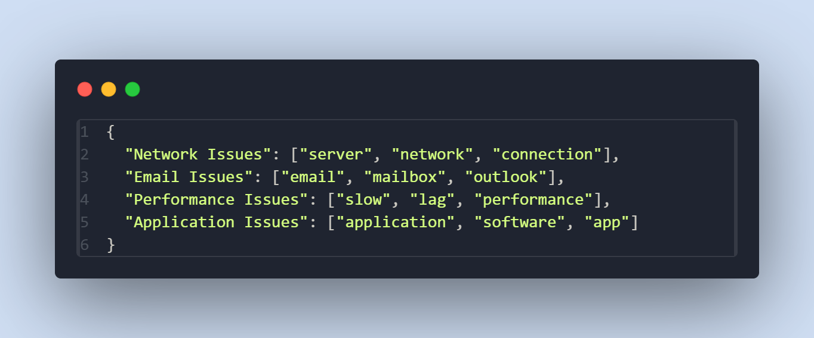
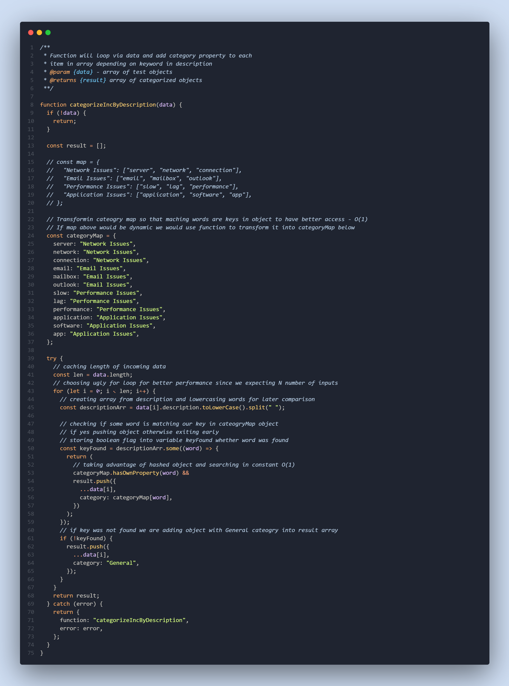

# Problem

##

1. Your task is to create a script that will process incident data received via a REST API. The script should perform keyword-based categorization of the incidents and assign them to the appropriate categories.

2. Input Data
   ;

3. Script Functionality

   1. The script should iterate through each incident in the JSON data.
   2. It should search the description field for any of the defined keywords.
   3. If a keyword is found, the incident should be assigned to the corresponding category.
   4. If no keyword is found, the incident should be assigned to the category General.

4. Output - The script should return the incidents with their assigned categories.

# Solution

;

# Conclusion

;
;
